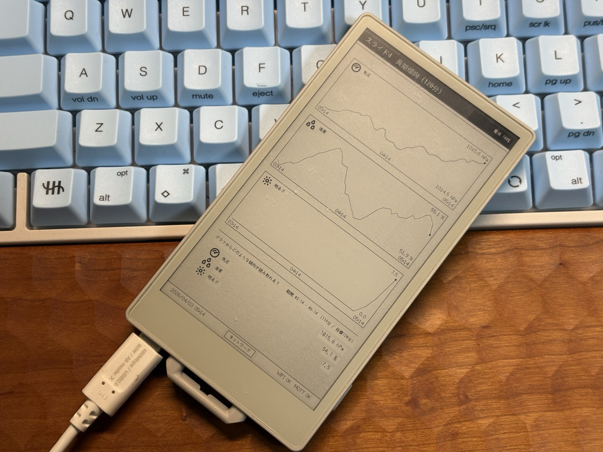
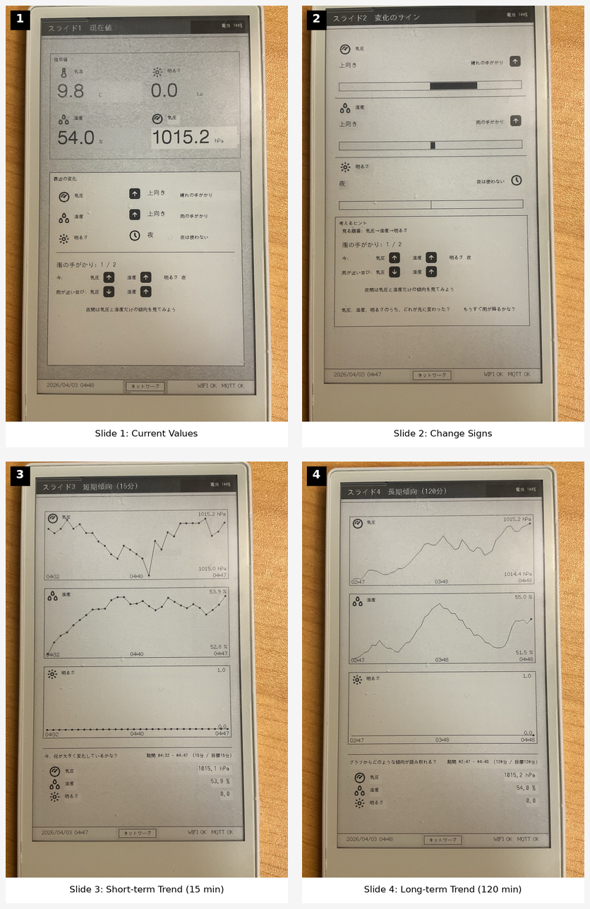

# M5PaperS3 Lux / Env Slides

[English README](./README.md)

[統合ハブ](https://github.com/omiya-bonsai/m5papers3-weather-learning-system)

## 概要

このスケッチは **M5PaperS3** 上で動作し、縦置きの教材用ダッシュボードを表示します。対象データは次の2系統です。

- `env4` から受信する屋外の気圧・湿度・気温
- `home/env/lux/*` から受信する窓際の照度データ

目的は高精度な天気予報ではありません。  
目的は、中学生が次の情報を見ながら

- 現在値
- 最近の変化
- 短期傾向
- 長期傾向

を読み取り、**「もうすぐ雨が降るかな？」** と考えられるようにすることです。

動作の様子を動画にして YouTube にアップしました。

## 現在のUI状態

- 縦置きレイアウトが標準です
- `config.h` で英語UI / 日本語UI を切り替えられます
- 通常ループは4枚の教材スライドです
- 送信機状態画面はフッターから入る補助画面です
- モノクロアイコンは `icons.h` で管理しており、現在は `32x32` 表示です
- 同一スライド内の更新では、ヘッダ / フッタ枠を再利用して本文中心に再描画します

## MQTT トピック

購読対象:

- `env4`
- `home/env/env4/status`
- `home/env/lux/raw`
- `home/env/lux/meta`
- `home/env/lux/status`

詳細:

- [MQTT トピック仕様](./docs/spec-topics.md)

## 保存

SDカードには次を保存します。

- `/logs/env4_log.csv`
- `/logs/lux_log.csv`
- `/state/latest.json`

動作方針:

- 最新値は `latest.json` から復元
- グラフ履歴は起動時に CSV から復元
- ただし古すぎる CSV 履歴は、ライブ受信時刻と比較して破棄することがあります

## スライド構成

### スライド1: 現在値

表示内容:

- 気温
- 湿度
- 気圧
- 明るさ
- 最近の変化
- 雨の手がかり

### スライド2: 変化のサイン

表示内容:

- 気圧 / 湿度 / 明るさ の変化方向
- 変化の強さバー
- 現在の並びと「雨が近い並び」を見比べるための `考えるヒント`

### スライド3: 短期傾向（15分）

表示内容:

- 気圧グラフ
- 湿度グラフ
- 明るさグラフ
- 現在値の要約

役割:

- 「今、何が変化している？」

### スライド4: 長期傾向（120分）

表示内容:

- 気圧グラフ
- 湿度グラフ
- 明るさグラフ
- 現在値の要約

役割:

- 「今までの流れは続いている？」

### 補助画面

フッター中央ボタン、または下から上へのスワイプで開きます。

表示内容:

- 送信機状態
  - ENV4送信機の状態
  - 明るさ送信機の状態
  - 各送信機の Wi-Fi / IP
  - 各送信機の再接続 / エラー回数
  - 最終受信時刻
- 本機情報
  - 本機名
  - ファーム名 / バージョン / ビルド日時
  - PaperS3 本体の IP / Wi-Fi / MQTT 状態
  - GitHub リポジトリ URL の QR コード
- フッターのボタンで `送信機状態` と `本機情報` を切り替え
- フッター右の `WIFI / MQTT` は PaperS3 本体の通信状態

## UIメモ

- `明るさ` は **昼間の手がかり** として扱います
- 日没後 / 日の出前で、暗い状態が一定時間続いた場合は、雨の手がかりの集計から `明るさ` を外します
- 昼間の基準パターン文言は `気圧↓ 湿度↑ 明るさ↓（昼の場合）` です
- 短期と長期では、意図的に時間窓を分けています
  - 15分
  - 120分

## 操作

- 通常ループ: スライド1 -> スライド2 -> スライド3 -> スライド4
- フッター中央ボタン: 補助画面を開く
- 補助画面の左ボタン: もう片方の補助画面へ切替
- 補助画面の右ボタン: メイン画面へ戻る
- 画面下部から上へのスワイプ: 補助画面を開く

## 必要ファイル

- [M5PaperS3-LuxEnv-Slides.ino](./M5PaperS3-LuxEnv-Slides.ino)
- [config.h](./config.h)
- [config.example.h](./config.example.h)
- [ui_text.h](./ui_text.h)
- [ja_assets.h](./ja_assets.h)
- [icons.h](./icons.h)

## 必要ライブラリ

- `M5Unified`
- `M5GFX`
- `WiFi`
- `PubSubClient`
- `ArduinoJson`
- `SD`

## ビルドメモ

- [ビルドメモ](./docs/build-notes.md)

## 関連ドキュメント

- [引き継ぎ](./docs/handoff.md)
- [UI計画](./docs/ui-plan.md)
- [判断記録](./docs/decision-log.md)
- [第三者素材](./docs/third-party-assets.md)

## 現在の焦点

現状:

- 英語UIは安定版として利用可能
- 日本語UIも同一リポジトリ内で利用可能
- `32x32` アイコン化とスライド遷移安定化は反映済みです
- 同一スライド更新時の再描画量は、ヘッダ / フッタ再利用で削減済みです
- いまの主課題は、レイアウトの最終調整とスライド本文側の再描画最適化です

## ライセンス

- このプロジェクトのライセンス: [MIT](./LICENSE)
- 第三者アイコン素材について: [docs/third-party-assets.md](./docs/third-party-assets.md)
