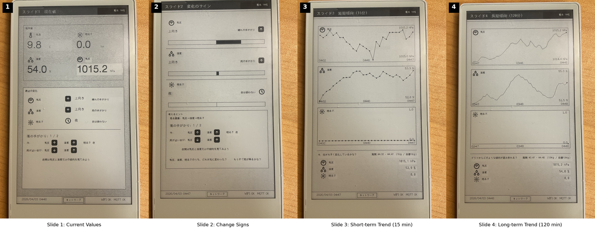

# M5PaperS3 Lux / Env Slides

[README日本語版](./README.ja.md)

## Overview

This sketch runs on **M5PaperS3** and shows a portrait teaching dashboard for reading weather clues from:

- outdoor pressure / humidity / temperature from `env4`
- window-side light data from `home/env/lux/*`

The goal is **not** precise weather prediction.  
The goal is to help a junior-high-school student learn how to read:

- current values
- recent changes
- short-term trends
- long-term trends

and think: **"Is rain getting closer?"**

## Current UI State

- Portrait layout is the default UI
- English and Japanese UI can be switched from `config.h`
- Main loop uses four teaching slides
- Network/status is a secondary screen opened from the footer button
- Monochrome icons are stored in `icons.h` and currently rendered at `32x32`
- Same-slide updates reuse header/footer framing and redraw the slide body only

## MQTT Topics

Subscribed topics:

- `env4`
- `home/env/lux/raw`
- `home/env/lux/meta`
- `home/env/lux/status`

See topic details:

- [MQTT topic spec](./docs/spec-topics.md)

## Storage

The sketch stores data on SD card:

- `/logs/env4_log.csv`
- `/logs/lux_log.csv`
- `/state/latest.json`

Behavior:

- latest values are restored from `latest.json`
- graph history is restored from CSV logs on boot
- stale CSV history can be discarded after comparing with live MQTT time

## Slides

### Slide 1: Current

Shows:

- current temperature
- current humidity
- current pressure
- current light level
- recent changes
- rain-sign summary

### Slide 2: Signals

Shows:

- direction of change for pressure / humidity / light
- sign strength bars
- a teaching card that helps the user compare:
  - current pattern
  - rain-sign pattern
  - question prompt

### Slide 3: Short-Term (15 min)

Shows:

- short-term pressure graph
- short-term humidity graph
- short-term light graph
- current summary

Purpose:

- "What is changing now?"

### Slide 4: Long-Term (120 min)

Shows:

- long-term pressure graph
- long-term humidity graph
- long-term light graph
- current summary

Purpose:

- "Is the trend continuing?"

### Network Screen

Opened from the footer button or upward swipe.

Shows:

- sensor state
- Wi-Fi state
- IP address
- retry / error counts
- updated time

## UI Notes

- `Light` is treated as a **daytime clue**
- after sunset / before sunrise, and after sustained darkness, light can be excluded from rain-sign counting
- the daytime clue text is shown as:
  - `Pressure down  Humidity up  Light down in daytime`
- short-term and long-term graph windows are intentionally different:
  - 15 min
  - 120 min

## Navigation

- normal loop: Slide 1 -> Slide 2 -> Slide 3 -> Slide 4
- footer center button: open `Network`
- footer center button on network screen: back
- upward swipe from bottom area: open `Network`

## Required Files

- [M5PaperS3-LuxEnv-Slides.ino](./M5PaperS3-LuxEnv-Slides.ino)
- [config.h](./config.h)
- [config.example.h](./config.example.h)
- [ui_text.h](./ui_text.h)
- [ja_assets.h](./ja_assets.h)
- [icons.h](./icons.h)

## Required Libraries

- `M5Unified`
- `M5GFX`
- `WiFi`
- `PubSubClient`
- `ArduinoJson`
- `SD`

## Build Notes

Important notes are collected here:

- [Build notes](./docs/build-notes.md)

## More Docs

- [Handoff](./docs/handoff.md)
- [UI plan](./docs/ui-plan.md)
- [Decision log](./docs/decision-log.md)
- [Third-party assets](./docs/third-party-assets.md)

## Current Focus

Current state:

- English UI is stable
- Japanese UI is available in the same repository
- 32px icons and slide-transition stability fixes are already reflected
- redraw work for same-slide updates has been reduced by reusing header/footer framing
- the main remaining work is layout refinement and additional redraw optimization inside slide bodies

## License

- Project license: [MIT](./LICENSE)
- Third-party icon assets: [docs/third-party-assets.md](./docs/third-party-assets.md)
